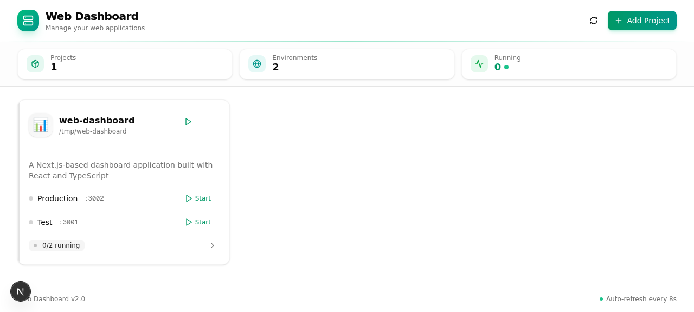
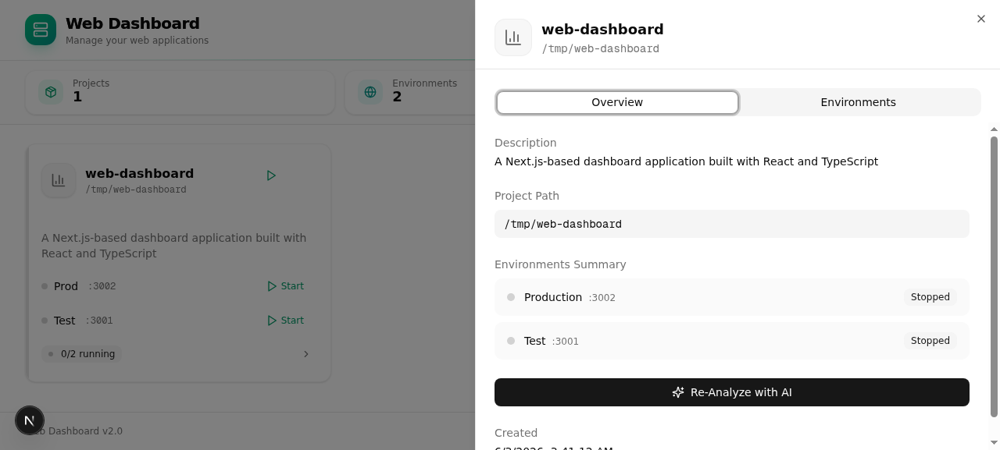

# Web Dashboard

一个本地项目管理仪表盘 —— 用一个统一的界面管理、启动、监控、跳转到所有本地运行的 Web 项目(脚本管理、PPTX 模板编辑器、PDB Tracker 等)。



## 功能特性

- **项目管理**:添加任意 Next.js / Python / Node 项目,登记 dev 和 production 两个环境
- **一键启停**:通过 dashboard 直接 start / stop / restart 子项目,日志实时回传
- **状态监控**:端口监听、进程 PID、运行时间,异常崩溃自动告警
- **LAN 链接**:每个 running environment 一键跳转到 `http://<your-lan-ip>:<port>`,手机/平板/同事电脑直接访问
- **端口编辑**:内置 port editor,改端口不用重启 dashboard
- **AI 分析** (可选):通过 Claude Code CLI 或 zai 自动分析项目并配置环境

## 截图

| 主页 | 项目详情 |
|---|---|
|  |  |

## 技术栈

- **框架**: [Next.js 16.1](https://nextjs.org) (App Router, Turbopack, standalone build)
- **UI**: React 19 + shadcn/ui + Radix UI + Tailwind CSS 4
- **状态管理**: Zustand + TanStack Query
- **数据库**: Prisma 6 + SQLite (`db/custom.db`)
- **包管理**: bun
- **进程管理**: child_process + 自写 `process-manager.ts` 安全管理子进程

## 快速开始

### 1. 克隆 & 安装

```bash
git clone https://github.com/Jing0715-fer/web-dashboard.git
cd web-dashboard
bun install
```

### 2. 配置环境

```bash
cp .env.example .env  # 然后填入 DATABASE_URL
bunx prisma db push   # 初始化 SQLite schema
```

`.env` 示例:
```bash
DATABASE_URL=file:./db/custom.db
```

### 3. 开发模式

```bash
bun run dev
# → http://localhost:3000
```

### 4. 生产模式

```bash
bun run build
bun run start
# → http://localhost:3000 (production, ready in ~250ms)
```

## API 一览

| 路径 | 方法 | 用途 |
|---|---|---|
| `/api/projects` | GET / POST | 项目列表 / 新建项目 |
| `/api/projects/[id]` | GET / PUT / DELETE | 项目详情 / 编辑 / 删除 |
| `/api/projects/[id]/environments` | GET / POST | 列出 / 添加环境 |
| `/api/projects/[id]/environments/[envId]/start` | POST | 启动环境 |
| `/api/projects/[id]/environments/[envId]/stop` | POST | 停止环境 |
| `/api/projects/[id]/environments/[envId]/restart` | POST | 重启环境 |
| `/api/projects/[id]/environments/[envId]/logs` | GET | 拉取环境日志 |
| `/api/projects/[id]/analyze` | POST | AI 智能分析项目结构 |
| `/api/network-info` | GET | 列出本机所有 LAN IP |
| `/api/gateway/status` | GET | OpenClaw Gateway 状态(可选) |

## 架构说明

### 进程管理 (`src/lib/process-manager.ts`)

Dashboard 启动子项目时,使用 `child_process.spawn` 派生子进程。**关键安全措施**:

- ✅ `isCommandSafe(cmd)`:白名单只允许 `bun`/`npm`/`node`/`python` 等已知工具前缀,且支持 `VAR=value cmd` 内联环境变量
- ✅ **环境隔离**:从 dashboard 父进程继承的 `__NEXT_PRIVATE_*`、`NEXT_DEPLOYMENT_ID`、`TURBOPACK` 等 Next.js 内部变量被剥离,避免子项目误读导致 `next build` 报 `JSON.parse` 错误
- ✅ **LAN 绑定**:自动注入 `HOSTNAME=0.0.0.0` 和 `HOST=0.0.0.0` 让子项目绑 IPv4,局域网可访问
- ✅ **崩溃重启**(launchd):可选地用 macOS launchd LaunchAgent 守护 dashboard 本身,系统重启后自动拉起

### Standalone Build

Dashboard 的 `bun run build` 会:
1. `next build` 生成 `.next/` 目录
2. 复制 `.next/static` 和 `public` 到 `.next/standalone/.next/`
3. 输出自包含的 `.next/standalone/server.js`(`bun .next/standalone/server.js` 即可启动,**无需 `node_modules`**)

### macOS 开机自启(可选)

```bash
# 安装 LaunchAgent
cp ~/Library/LaunchAgents/ai.lijing.web-dashboard.plist ~/Library/LaunchAgents/  # 或自己写
launchctl load -w ~/Library/LaunchAgents/ai.lijing.web-dashboard.plist
```

Dashboard 进程崩溃或系统重启后,launchd 会自动拉起。`~/Library/Logs/web-dashboard/` 记录 stdout/stderr。

## 已知限制

- **macOS 优先**:dashboard 使用 `~/Library/LaunchAgents/`,在 Linux 上需用 systemd
- **网络字体**:已移除 `next/font/google` 依赖(受限网络环境),使用系统字体栈
- **首次启动慢**:子项目 build 可能需要 1-20 秒,具体取决于项目复杂度

## License

MIT
